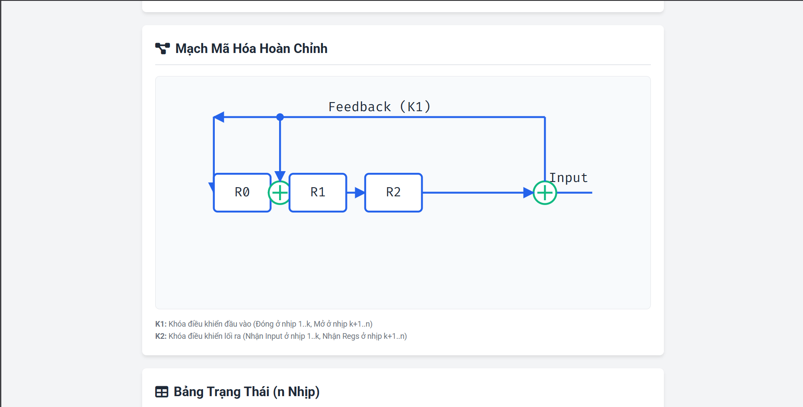
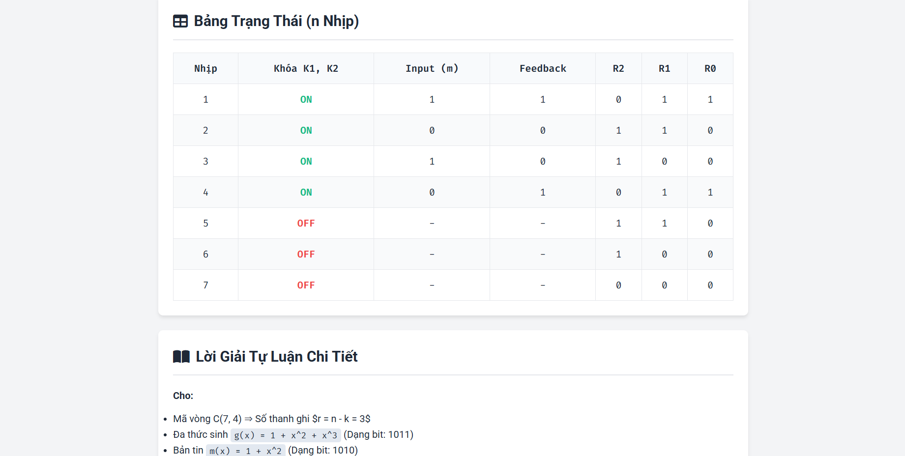
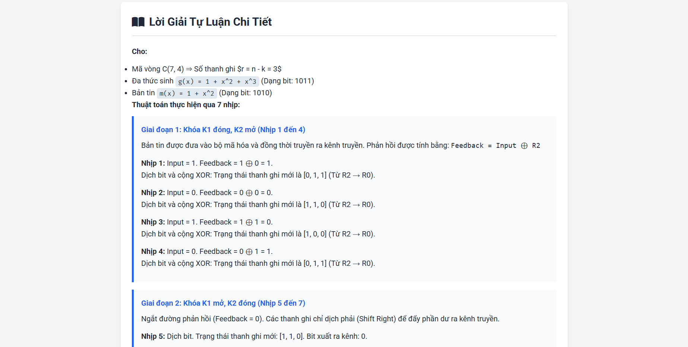
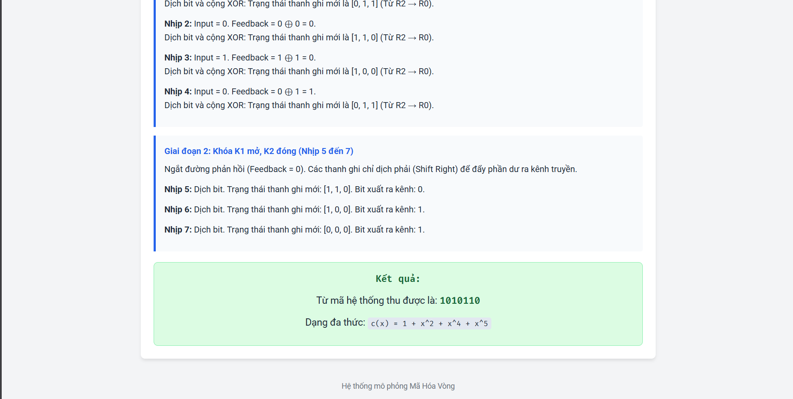

# Cyclic Encoder

A small C++ project that demonstrates encoding with cyclic codes (polynomial arithmetic over GF(2)). It includes a console encoder and a helper program `web_encoder` used by the web UI under `web/`.

## Demo










## Project Structure

```
CyclicEncoder/
├── Bit.h, Bit.cpp
├── BinaryVector.h, BinaryVector.cpp
├── CyclicEncoder.h, CyclicEncoder.cpp
├── main.cpp          # interactive console demo
├── web_main.cpp      # produces JSON output for web UI (builds to `web_encoder`)
├── tests/            # sample inputs and test runners
└── web/              # simple Node.js web UI that talks to `web_encoder`
```

## Building

Prerequisites:
- A C++ compiler supporting C++17 (g++, clang, or MSVC)

From the project root, build the console demo or the web helper as follows.

g++ / clang (MinGW, WSL, Linux):
```bash
g++ -std=c++17 -O2 -o cyclic_encoder main.cpp Bit.cpp BinaryVector.cpp CyclicEncoder.cpp
g++ -std=c++17 -O2 -o web_encoder web_main.cpp Bit.cpp BinaryVector.cpp CyclicEncoder.cpp
```

MSVC (Developer Command Prompt):
```cmd
cl /EHsc /std:c++17 main.cpp Bit.cpp BinaryVector.cpp CyclicEncoder.cpp /Fe:cyclic_encoder.exe
cl /EHsc /std:c++17 web_main.cpp Bit.cpp BinaryVector.cpp CyclicEncoder.cpp /Fe:web_encoder.exe
```

Quick Windows batch (example) — `build_web.bat`:
```bat
@echo off
g++ -std=c++17 -O2 -o web_encoder web_main.cpp Bit.cpp BinaryVector.cpp CyclicEncoder.cpp
if %ERRORLEVEL% neq 0 pause
```

## Usage

- Console demo:
```bash
./cyclic_encoder
# or on Windows
cyclic_encoder.exe
```

- `web_encoder` (JSON output used by `web/server.js`):
```bash
./web_encoder <n> <k> <g_str> <m_str>
# Example:
./web_encoder 7 4 1011 1101
```
This prints a single JSON object describing the encoding steps, remainder, and final codeword.

## Web UI

The `web/` folder contains a minimal Node.js server and static frontend that uses `web_encoder` to compute and display results. To run the web UI:

```bash
# install dependencies
cd web
npm install
# start server
node server.js
```

The server expects `web_encoder` to be available on `PATH` or in the project root; adjust `server.js` if you placed the binary elsewhere.

## Tests

Sample inputs are in `tests/`. Use the provided scripts to run them on Windows:

```powershell
.\run_tests.bat
.\run_tests.ps1
```

## Authors

- Le Dinh Hieu: B24DCAT095
- Vo Duy Thang: B24DCAT251
- Nguyen Thanh Dat: B24DCAT049
